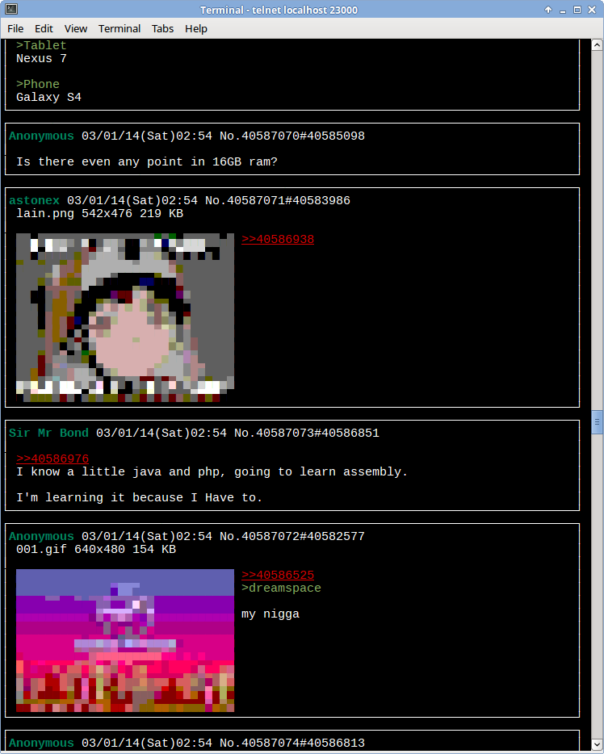

# ANSICHAN

```
 ____________________________________
< Truly the future of 4chan browsing! >
 ------------------------------------
        \   ^__^
         \  (oo)\_______
            (__)\       )\/\
                ||----w |
                ||     ||
```

ANSICHAN fills your sad-looking terminal emulators on your riced-out GNU+Linux
desktop with the fountain of 4chan. Jack into /a/ at:

    nc fountain.4chan.org 4751

and /g/ at:

    nc fountain.4chan.org 4752

`telnet` will probably work too, but ANSICHAN currently just spits UTF-8
over TCP, so telnet might not like everything it hears.

If you're not seeing the magic colors, make sure your terminal
supports 256 colors and UTF-8.

## Dude what



## Running Locally

You can run ANSICHAN locally (along with a local copy of [fountain][0] and
[phosphene][0] if you want), but it takes some doing:

    npm install
    sudo npm install -g LiveScript
    lsc -cb ansichan.ls
    BOARD="a" PORT="4751" node ansichan.js

By default, ANSICHAN will run against fountain.hakase.org, and stream /a/ to
port 4751. These can be controlled by the associated environment variables.

# License

[Unlicense][1], except for the image-drawing code adapted from [ansi-canvas][2],
which is under:

    MIT licensed Copyright (c) 2013 Nathan Rajlich <nathan@tootallnate.net>

    Permission is hereby granted, free of charge, to any person obtaining
    a copy of this software and associated documentation files (the
    'Software'), to deal in the Software without restriction, including without
    limitation the rights to use, copy, modify, merge, publish, distribute,
    sublicense, and/or sell copies of the Software, and to permit persons to
    whom the Software is furnished to do so, subject to the following
    conditions:

    The above copyright notice and this permission notice shall be included in all
    copies or substantial portions of the Software.

    THE SOFTWARE IS PROVIDED 'AS IS', WITHOUT WARRANTY OF ANY KIND, EXPRESS OR
    IMPLIED, INCLUDING BUT NOT LIMITED TO THE WARRANTIES OF MERCHANTABILITY,
    FITNESS FOR A PARTICULAR PURPOSE AND NONINFRINGEMENT. IN NO EVENT SHALL THE
    AUTHORS OR COPYRIGHT HOLDERS BE LIABLE FOR ANY CLAIM, DAMAGES OR OTHER
    LIABILITY, WHETHER IN AN ACTION OF CONTRACT, TORT OR OTHERWISE, ARISING FROM,
    OUT OF OR IN CONNECTION WITH THE SOFTWARE OR THE USE OR OTHER DEALINGS IN THE
    SOFTWARE.

[0]: https://github.com/qqueue/fountain
[1]: http://unlicense.org/
[2]: https://github.com/TooTallNate/ansi-canvas
